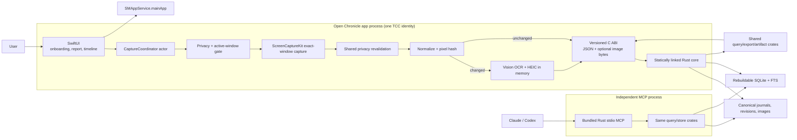

# Open Chronicle MVP - Implementation Plan

## Goal Capsule

Build a trustworthy, self-contained macOS 14+ application that observes one
privacy-approved foreground work surface on a fixed cadence, stores durable factual
evidence, derives deterministic five-minute chunks, and exposes the same facts
through a report, searchable timeline, documented export, and local MCP server.

The MVP must work offline after installation, require no developer tools or model
API key, and support both always-on personal use and an exact-expiry consultant
study mode. It must preserve the user's ability to see, pause, exclude, export,
repair, and delete what Chronicle controls.

The implementation combines product patterns rather than copying either predecessor
runtime:

- Adapt onboarding, menu-bar, settings, permission education, and timeline ideas
  from public `Screenata/open-chronicle` at
  `80437271e509c6dd2eba7be7c216e21c76aa41c5`.
- Adapt schema, config, privacy predicate, health, replay, retention-preview, and
  SQLite-projection concepts from Second Brain Chronicle at
  `17a6e875e39f104f15d80af8d0140f7e2657305d`.
- Rewrite capture, canonical persistence, chunking, MCP, app-to-core integration,
  dashboard, and packaging around this product contract.

The initial usable vertical slice is:

```text
synthetic observation
  -> durable journal
  -> rebuildable projection
  -> five-minute chunk
  -> statistics/search
  -> Swift fixture screen and MCP response
```

Live capture follows only after the evidence path is proven. Signing and public
notarization are release gates, but missing Apple credentials must not block an
unsigned development DMG.

### Explicit MVP exclusions

- Cloud sync, accounts, hosted dashboards, organization administration, or remote
  consultant access.
- Windows/Linux capture shells.
- Audio recording or native meeting capture.
- Semantic project/category assignment, workflow inference, productivity scoring,
  opportunity ranking, or automated recommendations.
- Automatic model calls, model-provider setup, or required API keys.
- Screenshot bytes or arbitrary local paths over MCP.
- Legacy-data migration in onboarding.

---

## Product Contract

`context.md` supplies the durable product framing. `docs/PRD.md` is the normative
requirement and acceptance source. This plan preserves its IDs so implementation,
tests, and review can trace back to the approved product behavior.

### Requirements

| ID | Implementation meaning |
| --- | --- |
| R1 | A real macOS 14+ app and drag-install DMG run without Node, Python, Rust, Xcode, a shell setup step, or a source checkout. |
| R2 | A resumable foreground first-run flow explains privacy, storage, modes, launch-at-login, and MCP; it proves actual capture before completion. |
| R3 | Every tick attempts to resolve one foreground window and captures only when exactly one approved window passes the shared pre/post privacy predicate; all other cases persist a factual outcome, with no desktop fallback. |
| R4 | Vision OCR and screenshot storage remain local; image expiry preserves OCR/events/chunks and is disclosed separately. |
| R5 | Each schedulable attempt uses independent attempt/evidence/presence/OCR axes and becomes a durable immutable event when storage is writable; failed persistence becomes visible health plus a later outage interval. |
| R6 | Event/chunk journals and immutable artifact revision files are canonical; SQLite/FTS is a cursor-driven, idempotent, fully rebuildable projection. |
| R7 | UTC-aligned five-minute chunks are deterministic immutable revisions with separate evidence/presence partitions, capped estimated durations, transitions, OCR excerpts, gaps, and version/input digest. |
| R8 | Home presents WakaTime-like factual hierarchy without semantic projects or productivity judgment; domain UI is capability-gated. |
| R9 | Timeline/search distinguishes captured, unchanged, idle, protected, paused, unavailable, and error states and drills to source evidence. |
| R10 | Opt-in bundled stdio MCP exposes grant-bounded factual reads with IDs, schema, coverage, provenance, pagination, capability/grant flags, and no screenshot bytes/paths. |
| R11 | MCP may create or append immutable derived-artifact revisions with valid evidence references but cannot change evidence, capture, privacy, retention, study, or deletion state. |
| R12 | Personal mode supports user-selected always-on/login behavior; study mode warns and auto-pauses at exact expiry, including across sleep. |
| R13 | Menu-bar controls and exclusions are immediate and visible; protected surfaces persist no sensitive pixels, titles, or OCR. |
| R14 | Export, screenshot retention, Delete Evidence, and Factory Reset have distinct inventories, confirmations, and matching-only integration cleanup. |
| R15 | One authoritative app process owns capture and aggregation; simultaneous MCP clients use the shared query service and never start loops. |
| R16 | No LLM secret is required; configuration/receipts are restrictive, reversible, and repairable; future secrets belong in Keychain. |

### Primary flows

| ID | Flow | Required proof |
| --- | --- | --- |
| F1 | Install and onboard | Fresh-user app launch through permission, safe capture/OCR proof, settings, optional login item, and report; register/self-test each supported agent that is present, otherwise show an optional repairable MCP state. |
| F2 | Record normal work | Visible state, scheduled outcomes, pause/resume, exclusions, restart, and honest gaps. |
| F3 | Run bounded study | Countdown/warning, exact auto-pause, wake-after-expiry block, explicit extend, local review/export. |
| F4 | Review report | Range totals, separate evidence/presence cards, app/window breakdown, optional domain, transitions, chunks, and evidence drill-down. |
| F5 | Explore timeline | Filters, OCR FTS, state bands, chunk/event detail, retained/expired image state. |
| F6 | Analyze through MCP | Claude/Codex read the same facts as UI and append only referenced derived-artifact revisions. |
| F7 | Export, retain, and delete | Stable-cutoff export, image lifecycle, evidence deletion, factory reset, and accurate remaining-data inventory. |

### Acceptance matrix

| ID | Owning units | Automated or runtime proof |
| --- | --- | --- |
| AE1 | U6, U9, U14 | Packaged clean-user onboarding on a Mac without developer tools. |
| AE2 | U7, U8 | Password-manager fixture/runtime test persists only a coarse protected outcome. |
| AE3 | U7, U8 | Pre-capture and post-capture secure-input transition tests prove no image file, hash, OCR, or title is persisted. |
| AE4 | U2, U4 | Ten interval-centered 30-second attempts from `09:00:15` to `09:04:45` produce a 300-second factual chunk with separate evidence/presence partitions. |
| AE5 | U4, U8, U10 | Three-minute permission loss is shown as unavailable coverage, never inactivity. |
| AE6 | U3, U5, U13 | Image expiry appends lifecycle evidence while original event/chunk/search remain. |
| AE7 | U4, U10, U11 | Aggregate-to-chunk-to-event IDs match across all drill-down levels. |
| AE8 | U5, U12 | MCP can create a referenced hypothesis; mutation surfaces are absent. |
| AE9 | U3-U14 | Network-disabled packaged smoke covers capture through query/export. |
| AE10 | U5, U8, U13 | Study expiry and sleep/wake fixtures block capture until explicit extension. |
| AE11 | U5, U8, U12 | App plus two MCP processes create no duplicate capture/chunk work. |
| AE12 | U9, U13 | Delete Evidence preserves settings/registration-grant receipts while inventorying managed diagnostics/exports; Factory Reset removes matching registrations and all managed data, reporting external copies. |
| AE13 | U2, U4, U8 | Ten interval-centered unchanged attempts retain one content artifact and 300 seconds of evidence coverage. |
| AE14 | U3 | Deleted/corrupt SQLite is rebuilt from event/chunk journals and artifact revisions with identical projected IDs/current state. |
| AE15 | U5, U10-U12 | After U10-U12, fixture parity returns identical UI/MCP chunks, totals, gaps, and search IDs; U12 independently consumes the language-neutral U2 query goldens. |
| AE16 | U4, U10 | Domain field absent means no domain claim and no domain component. |
| AE17 | U7 | Ambiguous foreground mapping records a skip and never uses whole-display capture. |
| AE18 | U3, U8, U13 | Journal failure creates no impossible event, visibly pauses/errors capture, and later appends a retrospective storage-outage interval. |
| AE19 | U3 | Crash after journal sync/before projection replays exactly once. |
| AE20 | U12 | MCP reports opaque image state only; byte/path and mutation tools are absent. |
| AE21 | U7 | PID/window change after capture discards pixels/OCR and records only a coarse status. |
| AE22 | U2, U7, U8 | Captured screenshot with failed OCR remains honest captured evidence with `ocr_state=failed`. |
| AE23 | U3, U5 | Full rebuild restores screenshot lifecycle, chunk supersession, and all artifact revisions. |
| AE24 | U3, U8 | Corrupt complete canonical line halts projection visibly rather than being skipped. |
| AE25 | U4, U10 | Evidence seconds sum to 300; presence sums only to captured coverage; idle never counts as app duration. |
| AE26 | U5, U12, U13 | Pre-deletion MCP client cannot write into a new store generation. |
| AE27 | U9, U13 | User-modified registration is preserved and reported during Factory Reset. |
| AE28 | U8 | Pause/record and login preference survive restart without duplicate work. |
| AE29 | U2-U5, U12-U13 | Canonical records, exports, MCP, and diagnostics contain no absolute managed paths. |
| AE30 | U4, U10-U11 | UTC chunk IDs survive travel/DST while local display changes correctly. |
| AE31 | U3, U5, U12 | Two MCP revisions from one expected prior yield one success and one typed conflict with one canonical chain. |
| AE32 | U3, U12-U13 | Delete Evidence waits for live MCP requests, increments generation, and prevents stale recreation. |
| AE33 | U3-U4 | Chunk append/sync/current-pointer/watermark crash boundaries recover to exactly one active revision. |
| AE34 | U3, U5, U13 | Image-delete intent/unlink/completion crashes resume to the correct final lifecycle. |
| AE35 | U3, U5, U7 | Provisional-image sync, observation append, promotion, and lifecycle-completion failures recover to pending evidence or no orphan, never a false retained acknowledgement. |
| AE36 | U5, U9, U12 | MCP defaults to no evidence without a grant; time/content/expiry/volume/pagination limits and immediate revoke are enforced. |
| AE37 | U6, U8, U9 | First/Dock/login/menu Open/window close/quit/logout/second-instance flows match the lifecycle contract without duplicate ownership or synthetic ticks. |

### Assumptions and constraints

- Product and repository name remain **Open Chronicle**; working bundle identifier is
  `com.screenata.openchronicle` until the Apple Team ID/final identity is confirmed.
- MVP minimum is macOS 14 because the exact-window single-frame capture path uses
  `SCScreenshotManager`. Sonoma 14, Sequoia 15, and current macOS 26 are the release
  matrix.
- Distribution is direct Developer ID, hardened runtime, and initially not App
  Sandbox. The app requests only Screen Recording; Accessibility is not a silent
  prerequisite.
- Application Support storage is local filesystem only with directories `0700`,
  files `0600`, and process `umask 077`.
- Rust uses a locked toolchain and one exact bundled SQLite source in both app/core
  and MCP. Startup and CI assert `sqlite_version()` is at least `3.51.3`, because
  earlier WAL builds have a known concurrent reset corruption defect. Prefer current
  upstream `3.53.3` when the pinned Rust binding exposes it; record source ID as well
  as version.
- Canonical totals are estimates based on scheduled observations and metadata-only
  idle state. UI copy says “observed computer time estimate,” not “worked time.”
- OCR/events/chunks remain until explicit evidence deletion even when screenshots
  expire. No evidence retention scheduler beyond screenshot retention is promised.
- Domain data is absent unless an explicit, authorized adapter supplies it; no
  browser adapter is required for MVP completion.
- Signing certificate, Team ID, notarization credential, dedicated clean Macs, final
  icon, and legal/privacy review are external release inputs.
- `SMAppService.mainApp` launches Chronicle at login but does not supervise a fatal
  app crash. MVP records the gap on relaunch rather than shipping a second daemon.
- MVP upgrades are manual DMG replacement and must preserve compatible Application
  Support evidence, settings, receipts, and grants. Automatic update delivery is
  post-MVP.
- The personal GitHub repository is the current remote because this account lacks
  `CreateRepository` permission in the Screenata organization; transfer is a later
  administrative operation and does not alter source history.

---

## Planning Contract

### Key technical decisions

#### KTD-1 — One app-owned core, not a capture daemon

**Decision:** The signed Swift app owns cadence, ScreenCaptureKit, Vision, TCC,
lifecycle, and one serialized Rust core handle linked as a universal static library
through a versioned C ABI. JSON request/response frames serve commands and queries;
a dedicated binary-aware ingest call accepts immutable request and encoded-image
byte buffers. A separate bundled universal `chronicle-mcp` binary links the same
domain/store/query crates but exposes only query and derived-artifact operations.

**Rejected alternatives:**

- A permanent Rust helper over pipes/sockets adds supervision, handshake, image
  spool, signing, reconnection, upgrade, and duplicate-owner failure modes.
- XPC provides native isolation but is disproportionate for the MVP and complicates
  Rust integration.
- Swift-owned persistence discards the reusable Rust core and Windows direction.

**Consequences and mitigations:**

- Rust panics must never unwind into Swift: every exported function uses
  `catch_unwind` with `panic=unwind`, converts errors into owned result bytes, and has
  an explicit free function. Rust copies input bytes during the call and retains no
  Swift pointer.
- Swift supplies a stable attempt/idempotency key, runs calls off `MainActor`, and
  serializes them through one actor. The opaque Rust handle also contains a mutex.
- A process-lifetime `capture-owner.lock` makes the first app instance authoritative;
  a second instance activates the first and never creates another coordinator.
- The MCP binary opens/closes a short-lived WAL connection per request, takes a
  shared store lock, and writes only canonical derived revisions plus projection.
- A schema/protocol handshake rejects incompatible library/app versions.
- Capture cannot continue if the UI process crashes. Launch at login is not crash
  supervision: recording stays stopped until manual relaunch or the next login, and
  restart recovery reports the gap honestly. A separate launchd helper is not MVP.
- The Swift `CoreService` protocol keeps an XPC migration seam if packaged soak or
  fatal FFI testing shows that in-process native failures are unacceptable.

#### KTD-2 — Journal first, projection second

**Decision:** Canonical events and chunks are daily append-only JSONL shards with a
body checksum. Derived artifacts use immutable per-artifact revision files with an
expected-prior-revision compare. Ingest or revision creation durably writes its
canonical record first, then commits an idempotent SQLite projection/cursor in one
transaction.

**Recovery contract:**

- Journal-ahead-of-index is replayed from the last committed byte cursor.
- SQLite-ahead-of-journal is structurally impossible.
- A partial trailing line is copied to diagnostics and recovery returns to the last
  newline; a corrupt complete line stops projection and raises critical health.
- Deleted/corrupt SQLite is rebuilt from event/chunk journals and artifact revision
  files plus authoritative `store-generation`, `config.json`, and
  `receipts/agent-registrations.json`, including lifecycle, grant, and supersession
  state. Projection cursors, health snapshots, watermarks, and current pointers are
  recomputed and equivalence-tested rather than treated as sources.
- Stable event/chunk/revision IDs make replay idempotent. Screenshot lifecycle is a
  typed event record; chunk supersession is in the chunk journal.
- All new journals, atomically renamed screenshots/artifact revisions, configuration,
  and receipts sync their parent directory. Managed file operations use anchored
  no-follow semantics rather than trusting string canonicalization.
- Projection cursors and a separate aggregation watermark reconcile journal-durable
  events, journal-durable chunks, late inputs, and current-chunk pointers.
- App/MCP requests take a cross-process shared store lock; rebuild/Delete Evidence/
  Factory Reset take exclusive maintenance access. Derived writes also take a
  per-artifact lock and expected-prior compare.

#### KTD-3 — Exact-window capture is the privacy boundary

**Decision:** Read `NSWorkspace.frontmostApplication` for the owner PID, inspect
front-to-back `CGWindowListCopyWindowInfo` metadata, filter to on-screen eligible
normal-layer windows with positive bounds/alpha owned by that PID, and choose the
first eligible window. Its window number must map to exactly one `SCWindow` before
using `SCContentFilter(desktopIndependentWindow:)` and `SCScreenshotManager`.
No-match or ambiguous mapping produces a factual gap; Chronicle never requests
Accessibility permission and never falls back to the full display.

**Race guard:** one shared privacy predicate evaluates study expiry, pause, lock,
sleep, permission, secure input, self/app/title exclusions, PID, and window identity
immediately before capture and immediately after capture. Any post-capture failure
discards pixels before hashing, OCR, encoding, or persistence. A permitted title may
change without changing identity. Protected outcomes store only coarse reason/policy
version.

#### KTD-4 — Every tick is evidence; pixels are optional

**Decision:** Serialized events have kind `observation-attempt`, `recording-gap`, or
`screenshot-lifecycle`. An observation uses independent attempt, evidence, presence,
and OCR axes; captured evidence can therefore coexist with idle presence or partial/
failed OCR. Changed content may retain a managed image and OCR. Unchanged content
references the prior content hash/event and discards duplicate pixels. Protected,
paused, unavailable, and failed attempts remain explicit.

A canonical attempt exists only after durable append. If storage fails, the app
keeps failure state in memory/OSLog, pauses capture visibly, and appends a
retrospective `storage-outage` interval after recovery. Sleep/quit likewise becomes
one factual gap interval on wake/relaunch rather than imaginary cadence events.

Ingest acknowledgement is separately `durable`,
`journal-durable-projection-pending`, or `not-durable`; projection health is
`current`, `lagging`, `rebuilding`, or `blocked`.

Idle input is only aggregate seconds/state from the operating system. Chronicle
never stores key/button values, coordinates, clipboard data, typed text, or an
input-event stream.

#### KTD-5 — Deterministic chunks and honest duration

**Decision:** Chunk boundaries are UTC epoch multiples of 300 seconds and are
half-open. Finalization waits one maximum configured cadence. Same-version output is
byte-stable for identical ordered inputs. Late/recovered input or a new aggregator
creates a new physical revision and updates a disposable `current_chunk` projection.

Adjacent successful samples use midpoint boundaries, with interval-centered first
and last samples clamped to bucket edges; each contribution is capped at 1.5 times
its cadence. Evidence-state seconds form one partition summing to 300. Presence-state
seconds separately partition captured coverage. Idle is not application time and
uncovered remainder is gap time. Canonical chunk text is extractive/deterministic.
Model prose is a derived artifact.

#### KTD-6 — Screenshot lifecycle is additive

**Decision:** Swift passes privacy-approved encoded image bytes and OCR metadata to
Rust in one synchronous off-main ingest call. Rust owns the managed image write and
records artifact ID, relative path, hash, dimensions, and `expires_at`; it never
retains the Swift buffer. Rust writes and syncs a restricted provisional image,
appends an observation with a pending artifact intent, promotes the image by anchored
atomic rename plus directory sync, appends a `screenshot-lifecycle` completion, and
only then acknowledges durable retained image evidence. If observation append fails,
it synchronously removes the provisional file and syncs the directory. Startup and a
bounded periodic reconciler complete interrupted promotions or remove orphaned
provisionals.

Expiry/user deletion is two-phase: append+sync `screenshot-delete-requested`, unlink
with no-follow anchored semantics and directory sync, then append+sync
`screenshot-delete-completed`. Startup completes pending intents. Missing/write-
failed states are additive lifecycle events; no retention process rewrites an
observation.

#### KTD-7 — One Rust query service for UI and MCP

**Decision:** Statistics, timeline, search, evidence drill-down, export selection,
and derived artifacts are typed core services. Swift uses the selected core boundary;
the official Rust MCP SDK (`rmcp`) adapts the same shared query/store crates over
stdio. No Swift SQL and no separate MCP query implementation are allowed.

MCP tools are bounded/paginated, never accept SQL or filesystem paths, return OCR as
`untrusted_evidence`, and cannot expose image bytes or destructive/control actions.
MCP opens/closes its SQLite handle inside each shared-lock request so exclusive
maintenance can prove no stale file descriptor remains. Both code products assert
matching schema/migration/build ID/SQLite source ID. Stdio owns stdout; logs go to
stderr.

#### KTD-8 — Direct distribution and native login item

**Decision:** Build a universal app and MCP helper for direct Developer ID
distribution with Hardened Runtime, a privacy manifest, and no broad runtime
exception entitlements. Use `SMAppService.mainApp` for launch-at-login. Sign nested
code inside-out, then notarize and staple the DMG.

Unsigned/ad-hoc artifacts are development proof only. Public-install success is not
claimed until a browser-downloaded quarantined DMG passes Gatekeeper on clean Macs.

#### KTD-9 — Separate monotonic cadence from civil time

**Decision:** Scheduling and retry cadence use a monotonic clock plus a boot/session
sequence; canonical records preserve wall-clock scheduled/observed/recorded UTC and
display timezone separately. Study expiry is an absolute UTC instant and is
rechecked on wake and system-time-change notifications. A backward or forward wall
clock correction creates an honest gap or late immutable revision without duplicate
IDs or a second tick loop.

#### KTD-10 — Explicit local trust and durability boundary

**Decision:** The signed Chronicle app/MCP processes and the user's macOS login
account are trusted. Permissions and anchored paths reduce accidental exposure but
do not defend against a compromised same-user process or erase backups. Checksums
detect corruption, not hostile tampering. A `durable` acknowledgement means
`fsync`/Rust `sync_all` plus required parent-directory sync completed under normal OS
semantics; it guarantees process/app-crash and ordinary restart recovery, not every
hardware-controller failure. Per-tick `F_FULLFSYNC` is excluded from MVP unless the
energy/SSD benchmark proves it acceptable.

### Component topology



### Scheduled observation lifecycle

```mermaid
stateDiagram-v2
    [*] --> BoundaryCheck
    BoundaryCheck --> StudyExpired: past study end
    BoundaryCheck --> Paused: user paused
    BoundaryCheck --> SystemGate: eligible
    SystemGate --> Unavailable: locked, asleep, or permission denied
    SystemGate --> Protected: secure input or exclusion
    SystemGate --> ResolveWindow: allowed
    ResolveWindow --> Unavailable: no exact window or ambiguity
    ResolveWindow --> CaptureMemory: exact SCWindow
    CaptureMemory --> CaptureError: API failure
    CaptureMemory --> Revalidate
    Revalidate --> Protected: foreground changed; discard
    Revalidate --> Deduplicate: shared predicate passes
    Deduplicate --> CapturedUnchanged: prior content hash; reuse OCR/artifact ref
    Deduplicate --> OCR: changed content
    OCR --> OCRPartial: partial or failed OCR
    OCR --> CapturedNew: success
    OCRPartial --> CapturedNew
    StudyExpired --> Journal
    Paused --> Journal
    Unavailable --> Journal
    Protected --> Journal
    CaptureError --> Journal
    CapturedUnchanged --> Journal
    CapturedNew --> Journal
    Journal --> NotDurable: append or sync fails
    NotDurable --> Health: pause + volatile health
    Journal --> Projection: durable or projection-pending
    Projection --> ChunkDue
    ChunkDue --> Health
    Health --> [*]
```



### Persistence and query flow

```mermaid
sequenceDiagram
    participant S as Swift CaptureCoordinator
    participant C as Rust Core
    participant J as Canonical store (managed files + JSONL)
    participant D as SQLite Projection
    participant Q as UI / MCP Query
    S->>C: ingest(request JSON + optional encoded image bytes)
    C->>C: validate policy, paths, schema, IDs
    C->>J: write + sync provisional image when present
    C->>J: append checksummed observation with pending image intent
    alt append or sync fails
      C->>J: remove provisional image + directory sync
      C-->>S: not-durable; pause and retain volatile health
    else journal durable
      J-->>C: sync_data complete
      C->>J: promote image + directory sync; append lifecycle completion
    end
    C->>D: idempotent projection + cursor transaction
    alt projection commits
      D-->>C: commit
      C-->>S: durable + current health
    else projection deferred
      C-->>S: journal-durable-projection-pending + lag health
    end
    C->>J: append due immutable chunk revision
    C->>D: project current chunk + aggregation watermark
    Q->>C: typed bounded query
    C->>D: read projection
    D-->>C: IDs + coverage + provenance
    C-->>Q: versioned response
```

### Storage layout

```text
~/Library/Application Support/com.screenata.openchronicle/
  evidence/events/YYYY-MM-DD.jsonl
  aggregates/chunks/YYYY-MM-DD.jsonl
  derived/<artifact-id>/<revision-id>.json
  screenshots/YYYY-MM-DD/<artifact-id>.heic
  index.sqlite3
  store-generation
  locks/{capture-owner,store,artifact-<id>}.lock
  config.json
  receipts/agent-registrations.json
  diagnostics/
  exports/
```

Evidence never stores an absolute managed path. Derived revision files are canonical;
SQLite projects their current/history views and can be rebuilt from them.
`store-generation`, `config.json`, and registration/grant receipts are authoritative
operational files. Projection cursors, health snapshots, aggregation watermarks, and
current pointers are ephemeral and recomputed during rebuild.

### Execution rules

- Each implementation unit is a reviewable acceptance boundary. The default is one
  coherent commit per unit; U1, U5, and U13 use the named subcommit checkpoints below
  so proof spikes and destructive lifecycle work do not become review-hostile mega
  commits. Do not mix unrelated checkpoints; commit messages below are defaults.
- A unit is complete only when its listed tests and verification pass. Record real
  failures rather than weakening checks.
- Synthetic text/images only in fixtures, logs, screenshots, and CI artifacts.
- Do not copy predecessor fixture screenshots or runtime capture code.
- UI units may start against the synthetic query fixture after U5/U6, but they must
  pass live-store parity before completion.
- Signing/notarization tasks may be blocked by external credentials; unsigned bundle
  and DMG verification still proceed.

---

## Implementation Units

### Unit index

| Unit | Commit boundary | Depends on | Primary contract |
| --- | --- | --- | --- |
| U1 | `chore: scaffold open chronicle workspace` + capture-spike checkpoint | None | R1, R3, R15, R16 |
| U2 | `docs: freeze versioned evidence contracts` | U1 | R4-R7, R10-R11 |
| U3 | `feat(store): add durable journal and projection recovery` | U2 | R5-R6, R14-R16 |
| U4 | `feat(engine): add factual chunking and queries` | U2-U3 | R5-R9, R12 |
| U5 | `feat(core): add policy artifacts export and shared query api` | U3-U4 | R10-R16 |
| U6 | `build(macos): add app shell and rust bridge` | U1, U5 | R1-R2, R15 |
| U7 | `feat(macos): add privacy-safe exact-window capture` | U2, U6 | R3-R5, R13 |
| U8 | `feat(macos): add recording lifecycle and health` | U4, U7 | R3, R12-R15 |
| U9 | `feat(macos): add onboarding privacy and integrations` | U5-U8, U12 | R1-R4, R10, R12-R16 |
| U10 | `feat(macos): add factual report home` | U4-U6 | R7-R8, R15 |
| U11 | `feat(macos): add evidence timeline and analysis` | U4-U6, U10 | R9, R11, R15 |
| U12 | `feat(mcp): add factual tools and derived artifacts` | U5 | R10-R11, R15-R16 |
| U13 | `feat(macos): add study retention export and recovery` | U5, U8-U12 | R12-R16 |
| U14 | `build: package verify and release macos dmg` | U6-U13 | R1-R2, R9-R16 |

Execution is dependency-driven rather than numeric-only: after U5, U12 can proceed
before U9 so onboarding registers and tests a real bundled MCP server. U10/U11 may
develop against U2/U5 query fixtures, but AE15 closes only after U10-U12 all pass the
same live-store parity corpus.

### U1 — Repository, toolchain, provenance, and CI skeleton

**Goal:** Establish a reproducible Rust/macOS workspace, attribution boundary, and
CI checks without importing unsafe predecessor runtime behavior.

**Targets:**

- `Cargo.toml`, `Cargo.lock`, `rust-toolchain.toml`
- `crates/chronicle-domain/Cargo.toml`, `crates/chronicle-domain/src/lib.rs`
- `crates/chronicle-store/Cargo.toml`, `crates/chronicle-store/src/lib.rs`
- `crates/chronicle-engine/Cargo.toml`, `crates/chronicle-engine/src/lib.rs`
- `crates/chronicle-ffi/Cargo.toml`, `crates/chronicle-ffi/src/lib.rs`
- `crates/chronicle-mcp/Cargo.toml`, `crates/chronicle-mcp/src/main.rs`
- `THIRD_PARTY_NOTICES.md`, `docs/provenance.md`, `docs/architecture.md`
- `.github/workflows/ci.yml`, `scripts/check-forbidden-runtime.sh`
- `spikes/macos-window-resolution/`, `docs/decisions/0001-window-selection.md`

**Approach:**

1. Pin stable Rust and use workspace dependency inheritance with `resolver = "2"`.
2. Use `serde`, `serde_json`, `thiserror`, `uuid`, `chrono`, `sha2`, and bundled
   `rusqlite`; defer async dependencies to MCP only.
3. Record both predecessor commit hashes, licenses, adapted concepts, and rejected
   runtime paths. Retain the public MIT notice and add per-file notices only when
   substantive code is later adapted.
4. Add a CI guard rejecting `CGWindowListCreateImage`, `/usr/sbin/screencapture`,
   runtime `node`/`npm`, source-tree helper paths, and real evidence fixtures.
5. Create a build matrix for Rust host plus both Apple Darwin targets. The Xcode
   test job becomes required once U6 adds the project.
6. Before U2 freezes capture contracts, build a minimal Swift proof that resolves
   `NSWorkspace.frontmostApplication`, filters front-to-back Core Graphics window
   metadata to the first eligible on-screen normal window for that PID, maps its
   window number to exactly one `SCWindow`, and takes a desktop-independent image.
   Record results without adapting either predecessor capture loop.

**Subcommit checkpoints:**

- **U1a** `chore: scaffold open chronicle workspace` — workspace, provenance, CI.
- **U1b** `spike(macos): prove exact foreground window selection` — compileable
  spike plus decision record. U2 is blocked until this spike proves or revises the
  no-Accessibility algorithm.

**Tests and verification:**

- `cargo metadata --no-deps` resolves all workspace members.
- `cargo fmt --all -- --check`, Clippy, and empty-crate tests pass.
- Provenance names exact source commits and separates reuse/adaptation/rewrite.
- Forbidden-runtime script fails on a temporary seeded forbidden string and passes
  on the clean tree.
- The spike is compile-tested and runtime-checked on available hardware for multiple
  windows, displays, Spaces/full screen, Stage Manager, sheets/popovers, minimized/
  occluded windows, and Retina scale; macOS 14/15/26 results are recorded as they
  become available, with untested matrix entries remaining explicit release gates.

### U2 — Versioned evidence contracts and synthetic corpus

**Goal:** Freeze the factual types before storage, capture, UI, or MCP can invent
incompatible semantics.

**Targets:**

- `contracts/event-v1.schema.json`
- `contracts/chunk-v1.schema.json`
- `contracts/derived-artifact-v1.schema.json`
- `contracts/query-v1.schema.json`
- `docs/contracts/event-v1.md`, `docs/contracts/chunk-v1.md`
- `docs/contracts/derived-artifact-v1.md`, `docs/contracts/query-v1.md`
- `crates/chronicle-domain/src/{event,chunk,artifact,query,ids,config,health}.rs`
- `fixtures/synthetic/session-v1/{events,chunks,queries,manifest}.json*`
- `crates/chronicle-domain/tests/{golden_schema,forward_compat,privacy_payload}.rs`

**Approach:**

1. Define a common envelope with schema version, stable ID, device ID,
   observed/recorded timestamps, local timezone, source, event kind
   (`observation-attempt`, `recording-gap`, or `screenshot-lifecycle`), and typed
   payload.
2. Model orthogonal exhaustive enums for attempt status, evidence state, presence
   state, OCR state, and durable acknowledgement. Captured-new/unchanged are evidence
   states; OCR failure and idle presence can coexist with captured evidence.
3. Keep protected payloads coarse by construction. They cannot deserialize fields
   for title, OCR, screenshot, or sensitive application identity.
4. Model screenshot references as opaque artifact IDs plus validated managed
   relative paths, hash, dimensions, and expiry. Lifecycle records model request/
   completion and projected retained/delete-pending/expired/user-deleted/missing/
   write-failed states.
5. Model presence state from metadata-only idle seconds and system state.
6. Define chunk logical key, revision ID, aggregator/input versions, supersession,
   coverage by state, estimates, gaps, transitions, excerpts, and evidence refs.
7. Define derived artifacts as immutable revisions with author/client/model, evidence
   references, status, expected prior revision, and store generation.
8. Define client disclosure grants with stable client/receipt identity, allowed UTC
   range or rolling horizon, metadata/OCR/derived content classes, expiry, per-page/
   response/cumulative byte caps, revoke state, and store generation.
9. Create an entirely synthetic workday containing changed/unchanged content,
   protected/idle/sleep/permission gaps, Unicode, prompt-like OCR, late input, and
   missing/expired image states.

**Tests and verification:**

- Golden JSON round-trips byte-stably after canonical ordering.
- Unknown optional fields survive or are ignored according to the compatibility
  rule; unknown major versions fail with a typed error.
- Path traversal/absolute-path inputs fail.
- Protected fixtures cannot contain title/OCR/image fields.
- OCR always carries the `untrusted_evidence` marker.
- Serialized enum values are contract-tested as kebab-case; Rust/Swift identifier
  spelling cannot leak into JSON values.
- No semantic project, workflow, productivity, intent, or recommendation field
  exists in canonical event/chunk types.

### U3 — Durable journal, SQLite projection, and recovery

**Goal:** Make evidence durable before acknowledging it and prove that every
queryable projection can be recovered from canonical shards.

**Targets:**

- `crates/chronicle-store/migrations/0001_init.sql`
- `crates/chronicle-store/src/{layout,journal,checksum,projection,recovery,sqlite,permissions,locks,generation,artifacts}.rs`
- `crates/chronicle-store/tests/{journal,crash_recovery,projection_rebuild,chunk_recovery,artifact_recovery,concurrency,permissions}.rs`
- `docs/data-contract.md`, `docs/recovery.md`
- `crates/chronicle-admin/Cargo.toml`, `crates/chronicle-admin/src/main.rs`

**Approach:**

1. Create the Application Support layout with restrictive permissions. Use anchored
   no-follow managed-file operations and refuse wrong ownership/root UID rather than
   trusting user-supplied or string-canonicalized paths.
2. Append checksummed event/chunk lines to shards named by UTC `recorded_at`/
   `generated_at` using `O_APPEND`; sync the file and new parent directory and never
   read-modify-rewrite a journal.
3. Lock one exact bundled SQLite source in app/MCP, assert version `>=3.51.3` and
   source ID, enable foreign keys, WAL, `synchronous=FULL`, and a bounded busy timeout.
4. Add migrations for schema versions, projection cursors, events, typed
   observations, OCR FTS, chunk revisions/current pointers, evidence refs,
   dimensions/transitions, artifact revisions, health, retention, store generation,
   aggregation watermark, and registration receipts.
5. Project by stable ID inside one transaction and update the byte cursor only with
   projected rows. Reconcile a separate aggregation watermark against every due
   event bucket and journal-durable chunk revision.
6. Write artifact revisions by same-directory temp/sync/atomic rename/directory sync
   under a per-artifact lock and expected-prior compare, then project them.
7. Implement cross-process shared request locks and exclusive rebuild/delete/reset
   maintenance lock plus durable store generation.
8. On startup, validate shard tails and derived revision files, preserve a diagnostic
   copy of incomplete bytes, replay complete unindexed records, and stop visibly on a
   corrupt complete record. A corrupt shard is sealed at its last verified offset;
   Chronicle preserves the original shard/checksum, starts a successor shard only
   after user-confirmed repair, records a repair/loss marker there, quarantines
   unverified later bytes, and never silently skips the damaged line or claims
   healthy state.
9. Add `chronicle-admin rebuild-index`, `verify-journals`, and synthetic `replay`
   commands. They never capture or migrate predecessor data.
10. Rebuild reads canonical journals/revisions plus authoritative
    `store-generation`, `config.json`, and registration/grant receipts; cursors,
    current pointers, watermarks, and health snapshots are reconstructed and checked
    for query-equivalent output.

**Tests and verification:**

- Inject failures after provisional screenshot sync, observation append, image
  promotion/directory sync, lifecycle completion, artifact rename/directory sync,
  event/chunk append/sync, row insert, cursor/current-pointer/watermark update, and
  transaction commit. Restart never loses or duplicates acknowledged records and
  selects exactly one active chunk revision.
- Partial tail recovers to the prior newline with a health record; a bad complete
  checksum blocks projection until explicit repair, preserves the damaged original,
  and produces a successor repair marker without silently accepting later bytes.
- Duplicate event ID replay is idempotent.
- Deleting SQLite and rebuilding from event/chunk journals plus artifact revision
  files produces identical stable IDs, lifecycle state, supersession, and queries.
- Two writer processes racing from one expected artifact revision yield one success
  and one typed conflict without an orphaned canonical file.
- Shared requests, exclusive rebuild/delete, store-generation change, and stale
  client reopen/error semantics are process-tested without unbounded lock waits.
- Disk full/permission failure returns non-durable acknowledgement and a critical
  health state.

### U4 — Ingestion, five-minute chunker, search, and statistics

**Goal:** Convert ordered factual attempts into reproducible five-minute evidence
and the bounded queries required by both product surfaces.

**Targets:**

- `crates/chronicle-engine/src/{ingest,chunker,coverage,duration,reconcile,health}.rs`
- `crates/chronicle-store/src/{queries,search,statistics}.rs`
- `crates/chronicle-engine/tests/{ingest_contract,chunk_contract,duration,late_input,clock_domains}.rs`
- `crates/chronicle-store/tests/{query_contract,fts,statistics}.rs`
- `docs/aggregation.md`

**Approach:**

1. Validate attempt schema/policy/managed artifacts, append the canonical event,
   project it, then finalize any due bucket.
2. Bucket by `floor(unix_ms / 300000)` and finalize after boundary plus maximum
   cadence. Sort input deterministically by observed time and stable ID.
3. Calculate a non-overlapping evidence partition of captured/protected/paused/
   unavailable/error/gap seconds that sums to 300, plus a separate active/idle/
   unknown presence partition over captured coverage. Never interpret absence as
   inactivity.
4. Apply midpoint duration attribution with a `1.5 × cadence` cap and explicit
   remainder gaps; never bridge lock/sleep/permission/protection gaps.
5. Produce deterministic extractive OCR deltas/excerpts with bounded lengths and
   source IDs. Prompt-like text remains inert data.
6. Emit immutable revisions keyed by device/boundary/aggregator/input digest. Late
   input supersedes rather than mutates.
7. Reconcile event cursor, chunk journal, current pointer, and aggregation watermark
   after every startup/crash boundary.
8. Implement typed range queries for statistics, current chunks, dimensions,
   transitions, event detail, evidence refs, and FTS snippets. Semantic or grouped
   work sessions remain post-MVP.
9. Keep monotonic cadence/boot sequence separate from wall timestamps; time changes
   may create a gap or late revision but cannot reuse IDs or schedule duplicate ticks.

**Tests and verification:**

- Boundaries at UTC/local midnight, DST forward/back, clock rollback, and cadence
  change behave deterministically.
- Ten interval-centered attempts from `:15` through `:45` create ten events, one
  content artifact, and 300 seconds of evidence coverage.
- All-protected/all-gap/mixed-idle chunks have correct state totals.
- Duration never exceeds covered bucket seconds and never crosses a gap.
- Re-running identical input/version yields identical canonical bytes.
- Late input creates a revision/supersession; old bytes remain.
- Failure around chunk calculation/append/sync/current-pointer/watermark produces one
  deterministic current revision after restart.
- FTS handles quotes, operators, Unicode, empty/large OCR, pagination, and escaped
  bounded highlights.
- Domain absence does not produce inferred values.

### U5 — Shared core API, derived artifacts, policy, export, and health

**Goal:** Expose one bounded Rust application service that all Swift and MCP product
surfaces use without duplicating persistence or SQL.

**Targets:**

- `crates/chronicle-engine/src/{service,policy,grants,retention,study,export,artifacts,health}.rs`
- `crates/chronicle-domain/src/api.rs`
- `crates/chronicle-store/src/{retention,export,artifacts,receipts}.rs`
- `crates/chronicle-engine/tests/{service_contract,grants,retention,study,export,artifact,health}.rs`
- `docs/query-contract.md`, `docs/privacy-model.md`

**Approach:**

1. Define request/response enums for open, ingest, finalize, status, health, range
   statistics, chunks, search, detail, evidence refs, exports, artifacts, retention
   preview/apply, study state, and recovery.
2. Make queries bounded by range/page/byte limits and return schema, range/timezone,
   stable IDs, coverage/gaps, capability flags, cursor, and truncation notices.
3. Enforce an explicit per-client disclosure grant before every agent-facing read.
   Intersect the requested range with its UTC horizon, content classes, expiry,
   per-response and cumulative byte caps; full OCR defaults to denied, pagination
   cannot escape the grant, and revoke takes effect on the next request.
4. Validate every derived-artifact evidence reference and implement canonical
   immutable revision-file create/revise/status transitions with expected-prior and
   store-generation checks. Project only after atomic file sync/rename. There is no
   evidence mutation API.
5. Build context-packet and full-evidence export at a stable journal cutoff with a
   manifest, counts, included/excluded classes, checksums, gaps, and truncation.
   Screenshots are excluded by default.
6. Implement screenshot-retention preview/apply through two-phase delete-request/
   unlink+directory-sync/delete-completed lifecycle events. Startup completes pending
   requests; events/OCR/chunks remain.
7. Implement exact study boundary checks and explicit extension in core so every
   caller gets the same answer.
8. Produce content-free diagnostic health with last attempt/capture/OCR/journal/
   projection/chunk, aggregation watermark, acknowledgement/projection state, lag,
   storage, permissions, study, retention, and MCP status.
9. Coordinate provisional image intent through the service so acknowledgement is
   retained-image durable only after observation sync, promotion/directory sync, and
   lifecycle completion; reconcile pending intents on startup and periodically.

**Subcommit checkpoints:**

- **U5a** `feat(core): add shared service policy grants and health`.
- **U5b** `feat(core): add derived artifacts and stable-cutoff export`.
- **U5c** `feat(core): add screenshot retention and exact study boundaries`.

**Tests and verification:**

- Query results are stable for the synthetic fixture and enforce all caps.
- No grant, expired/revoked grant, OCR-denied grant, range overflow, cumulative-byte
  overflow, and cursor escape all fail without disclosing evidence.
- Dangling evidence refs, stale expected revision, stale store generation, and
  invalid artifact transitions fail.
- No request enum can pause capture, change privacy, delete evidence, or return image
  bytes through an agent-facing capability.
- Export checksum/counts match the stable cutoff during concurrent ingestion.
- Retention deletes only images and appends lifecycle evidence.
- Failure at each provisional-image transaction boundary yields a recoverable
  pending intent or no orphan and never a false retained-image acknowledgement.
- Study expiry rejects the first post-expiry ingest, including simulated wake.
- Health diagnostics contain no OCR, title, screenshot path, or user content.

### U6 — macOS application shell and Rust FFI bridge

**Goal:** Launch a native foreground app that can call the shared Rust service from
a universal bundled build without developer tools.

**Targets:**

- `include/chronicle.h`
- `crates/chronicle-ffi/src/lib.rs`
- `macos/OpenChronicle.xcodeproj/project.pbxproj`
- `macos/OpenChronicle/App/{OpenChronicleApp,AppModel,NavigationModel}.swift`
- `macos/OpenChronicle/Engine/{ChronicleCore,ChronicleFFI,ChronicleTypes}.swift`
- `macos/OpenChronicle/Resources/{Info.plist,OpenChronicle.entitlements,PrivacyInfo.xcprivacy}`
- `macos/OpenChronicleTests/{BridgeTests,FixtureParityTests}.swift`
- `scripts/build-rust-universal.sh`

**Approach:**

1. Export `chronicle_open`, `chronicle_call`, `chronicle_ingest`,
   app-only `chronicle_image_read`, `chronicle_close`, `chronicle_schema_version`,
   and `chronicle_buffer_free` only. `chronicle_ingest`
   receives request pointer/length plus nullable encoded-image pointer/length and
   copies bytes during the call. Wrap every entry in `catch_unwind` with
   `panic=unwind`; never return or retain borrowed memory.
   `chronicle_image_read` accepts only an opaque artifact ID and expected store
   generation, resolves it through anchored no-follow managed lookup plus projected
   retained lifecycle state, returns bounded owned bytes, and is never linked into
   the MCP capability surface.
2. Define a Swift `CoreService` protocol and an `InProcessCore` actor implementation.
   Execute calls off `MainActor`, decode versioned envelopes, serialize access, and
   surface schema mismatch as repair health. The opaque Rust handle also serializes
   internally.
3. Add a regular `WindowGroup` for onboarding/home plus `MenuBarExtra` for quick
   status. Do not switch to accessory-only mode before onboarding finishes.
   `NavigationModel` owns typed home/timeline/chunk/event/analysis/settings routes,
   preserved range/filter context, menu/notification deep links, deterministic back,
   and close-window restoration.
4. Build arm64/x86_64 static libraries with deployment target 14.0, combine with
   `lipo`, and link the Xcode target.
5. Add `NSScreenCaptureUsageDescription`, minimal hardened entitlements, and a
   privacy manifest. Do not add network, JIT, debugger, or library-validation bypass
   entitlements.

**Tests and verification:**

- Rust FFI panic test returns a typed error and leaves Swift alive.
- Repeated open/call/ingest/image-read/free/close plus null/malformed/oversized/invalid UTF-8/
  panic cases under sanitizers/fuzzing have no leak, double free, unwind, or retained
  input pointer.
- Image read rejects stale generation, expired/deleted/missing state, path traversal,
  and oversized bytes without returning a filesystem path.
- Fixture statistics/chunk/search responses decode and retain exact IDs.
- `lipo -archs` shows `arm64 x86_64` for the linked core.
- A Debug app launched outside Xcode reads the fixture and opens the main window.

### U7 — Privacy-safe foreground capture, Vision OCR, and idle state

**Goal:** Capture only an exactly authorized foreground window and prove denied
surfaces persist no pixels or text.

**Targets:**

- `macos/OpenChronicle/Capture/{ActiveWindowProvider,PrivacyPreflight,ScreenCaptureService,VisionOCRService,ContentDeduplicator,IdleStateSource}.swift`
- `macos/OpenChronicleTests/{ActiveWindowProviderTests,PrivacyPreflightTests,CaptureRaceTests,OCRTests,DedupTests}.swift`
- `docs/security.md`, `docs/privacy.md`

**Approach:**

1. Resolve `NSWorkspace.frontmostApplication`, inspect front-to-back
   `CGWindowListCopyWindowInfo`, filter to the first eligible on-screen normal-layer
   window with positive bounds/alpha for that owner PID, and require its exact window
   number to map to one `SCWindow` from `SCShareableContent`. No Accessibility API is
   required; no-match/ambiguity is a gap.
2. Evaluate one shared predicate for study expiry, pause, lock/sleep/permission/
   secure-input/self/app/title policy, PID, and window identity immediately before
   and immediately after capture. Seed password-manager and sensitive system bundle
   IDs; offer mail/messaging as user-selected exclusions rather than silently
   excluding all.
3. Use `SCContentFilter(desktopIndependentWindow:)` and
   `SCScreenshotManager.captureImage`; set correct point/pixel dimensions and Retina
   scale. Never call whole-display APIs.
4. Re-evaluate the shared predicate after capture. On any failure discard pixels
   before hash/OCR/encoding/persistence and record a coarse outcome; a permitted
   title change alone does not fail identity.
5. Downsample approved pixels deterministically to at most 2,560 pixels on the long
   edge and 8 megapixels, hash the normalized pixels, and compare with the prior
   content before OCR. Unchanged content reuses the prior OCR/artifact reference and
   skips Vision and HEIC work.
6. For changed content, run `VNRecognizeTextRequest` in memory, preserve engine/
   language/confidence/hash, mark text untrusted, and encode HEIC at a bounded quality
   and maximum 4 MiB payload.
7. Pass immutable changed-image bytes plus OCR metadata to `chronicle_ingest`; Rust
   alone writes managed evidence files.
8. Read aggregate system idle seconds and configured threshold only; no input-event
   tap or value collection.
9. Normal product-self exclusion remains unconditional. Onboarding may mint one
   memory-only, immediately invalidated proof token scoped to one dedicated Chronicle
   test-window ID with fixed synthetic text; it authorizes only that capture and
   cannot persist or broaden normal policy.

**Tests and verification:**

- Unit fixtures cover self, password manager, title pattern, secure input, denied/
  revoked permission, locked/asleep, no window, ambiguous window, and foreground
  switch during capture.
- Every denied case asserts no temp/final image, OCR, or protected title exists.
- A secure-input transition after capture but before hashing exercises the same
  predicate and proves no image/hash/OCR/title reaches ingest.
- Unchanged content proves Vision and HEIC were not invoked.
- The onboarding proof token succeeds only for its exact test-window ID/text, fails
  for every other Chronicle window, and is unusable after one attempt or relaunch.
- Runtime matrix covers multiple displays/windows, full-screen Spaces, Stage Manager,
  minimized/occluded windows, sheets/popovers, and Retina scaling.
- Source/CI scan proves no `CGWindowListCreateImage`, `screencapture`, or desktop
  fallback.

### U8 — Scheduler, lifecycle, modes, login item, and health

**Goal:** Run one visible and recoverable observation engine across launch, pause,
sleep/wake, permission changes, errors, and study expiry.

**Targets:**

- `macos/OpenChronicle/Capture/CaptureCoordinator.swift`
- `macos/OpenChronicle/Services/{LifecycleMonitor,LaunchAtLoginService,NotificationService,StorageMonitor}.swift`
- `macos/OpenChronicle/App/MenuBarContent.swift`
- `macos/OpenChronicle/Features/Health/{HealthView,HealthViewModel}.swift`
- `macos/OpenChronicleTests/{CoordinatorTests,LifecycleTests,StudyExpiryTests,LaunchAtLoginTests}.swift`

**Approach:**

1. Acquire a process-lifetime `capture-owner.lock` before starting the one
   `CaptureCoordinator` actor. A second app instance activates the first and never
   starts capture. Expose heartbeat/owner/store generation for diagnostics.
2. Form one attempt at each scheduled tick and acknowledge it only when durable. On
   storage failure pause visibly; on recovery append a retrospective `storage-outage`
   interval. On sleep/quit/crash resume, append one honest gap interval from the last
   durable heartbeat and never backfill guessed cadence attempts.
3. Check study expiry before every capture and before the first wake tick. Auto-pause
   exactly at expiry and offer only explicit Extend/End actions.
4. Pause capture on non-durable journal/storage errors; require successful repair or
   user resume. Projection lag alone may recover from the journal without losing
   capture if canonical append remains healthy.
5. Use `SMAppService.mainApp` with registered/enabled/requires-approval/not-found
   states and direct navigation to System Settings when approval is required.
6. Show recording/paused/protected/unavailable/expired/error status in menu bar and
   full health detail in the app.
7. Drive tick deadlines from a monotonic clock/boot sequence while recording wall
   UTC separately; re-evaluate study expiry on wake and time-change notification.
8. Warn at 4 GiB free space and pause before starting another capture below 2 GiB or
   when the configured 20 GiB managed-image quota is reached. Never acknowledge an
   image/event that exceeds a budget midway through its durable transaction.
9. Use one notification matrix for pre-expiry, expiry, permission loss, storage
   failure, and recovery. Menu-bar state is the guaranteed fallback; optional system
   notifications are deduplicated, rate-limited, and deep-link through typed routes.

**Lifecycle interaction contract:**

| Trigger | Main window | Dock/menu bar | Capture behavior |
| --- | --- | --- | --- |
| First launch or explicit Dock launch | Show and focus | Dock + menu visible | Start only after onboarding/policy permits |
| Login launch after onboarding | Stay closed | Menu visible | Restore saved recording/pause setting |
| Menu-bar Open | Show/focus existing route | Menu visible | Unchanged |
| Close main window | Close only window | Menu remains | Continue recording; one-time education may explain this |
| Command-Q | Exit | Both exit | Flush best effort, stop capture, next launch records one quit gap |
| Logout/shutdown | Exit | Both exit | Flush best effort; reconcile gap on next launch |
| Second-instance launch | Activate first main window | One menu owner | Never create a second coordinator |

`SMAppService.mainApp` does not restart a crashed process. A packaged fatal-crash
test must prove the stopped state and honest relaunch gap rather than implying
supervision.

**Tests and verification:**

- Deterministic clock tests cover 30/60 cadence, pause/resume, sleep/wake, clock
  rollback, permission revoke/regrant, study expiry, and storage failure.
- Wake after expiry produces no capture call until explicit extension.
- Relaunch/replay produces no duplicate event/chunk.
- First/Dock/login/menu Open/window close/quit/logout/second-instance scenarios match
  the lifecycle table, including focus restoration and saved range/filter route.
- Notification tests cover dedupe/repeat intervals, denied notification permission,
  menu-bar fallback, action deep links, and recovery clearing.
- Fatal crash leaves recording stopped until manual relaunch/next login and the next
  launch records exactly one gap interval.
- Two simultaneous MCP processes do not affect scheduler ownership.
- Login item enable/disable/approval states match `SMAppService` runtime status.

### U9 — Onboarding, privacy/settings, and reversible integrations

**Goal:** Let a non-technical user reach a proven recording state in under ten
minutes and recover from partial or conflicting setup.

**Targets:**

- `macos/OpenChronicle/Onboarding/{OnboardingView,OnboardingModel,WelcomeStep,ModeStep,PrivacyStep,PermissionStep,CaptureProofStep,LoginStep,AgentStep,CompletionStep}.swift`
- `macos/OpenChronicle/Features/Settings/{SettingsView,PrivacySettingsView,IntegrationSettingsView,DisclosureGrantView}.swift`
- `macos/OpenChronicle/Services/{AgentDetectionService,AgentRegistrationService,InstallLocationService}.swift`
- `macos/OpenChronicleTests/{OnboardingTests,AgentRegistrationTests}.swift`
- `macos/OpenChronicleUITests/OnboardingFlowTests.swift`

**Approach:**

1. Persist a resumable onboarding state machine; no step is marked complete from
   preflight alone when a live proof is available.
2. Explain scheduled outcomes, local screenshots, separate OCR retention, default
   exclusions, metadata-only idle, agent-query disclosure, and Delete Evidence vs
   Factory Reset in plain language.
3. Let user choose personal/study, cadence, screenshot retention, exclusions, study
   end, and launch-at-login. Study default is bounded and cannot silently become
   personal mode.
4. Request Screen Recording and run an actual safe Chronicle-owned test window
   capture/OCR round trip through the one-shot exact-window proof token. Handle
   denial, relaunch, revoke, and partial resume without weakening normal self-exclusion.
5. Detect supported Claude Desktop, Claude Code, Codex desktop, and Codex CLI
   installations/versions and only register after the app is copied out
   of a DMG/translocated path. Use official CLI commands; never directly edit global
   config or instruction files.
6. Store a receipt with client/version/name/resolved helper path/prior matching state
   and result. Repair detects moved apps; conflict never overwrites a different
   server. Unregister removes only exact receipt-matching entries.
7. If no supported agent exists, complete onboarding with MCP marked optional/
   repairable rather than blocking recording.
8. Before registration, create an explicit per-client disclosure grant. Default to
   no OCR and a short user-selected time horizon; show allowed content classes,
   expiry, response/cumulative limits, active clients, and immediate revoke.
9. Use `NavigationModel` for onboarding completion, menu/notification deep links,
   settings/repair, and return-to-prior report/timeline context.

**Tests and verification:**

- UI tests resume from every interrupted step and exercise denied/revoked permission.
- Capture proof fails if it cannot retrieve the expected synthetic text.
- Agent absent, Claude Desktop, Claude Code, Codex desktop, Codex CLI, supported and
  unsupported versions, hidden GUI `PATH`, moved app, existing same registration,
  and conflicting registration are covered. At least one installed supported desktop
  client completes registration and self-test without terminal use; unsupported
  surfaces get a version-gated guided fallback.
- Registration is blocked from mounted DMG/translocated location.
- Receipt redacts secrets and supports matching-only repair/unregister.
- Grant UI and tests cover default deny, scope editing, expiry, immediate revoke,
  client conflict, and accessible non-color disclosure of active access.
- Tab order, initial/restored focus, VoiceOver announcements, countdown updates, and
  keyboard-only destructive confirmations pass accessibility tests.

### U10 — WakaTime-inspired factual report home

**Goal:** Make a day/week of evidence understandable without implying productivity
or hiding uncertainty.

**Targets:**

- `macos/OpenChronicle/Features/Home/{HomeView,HomeViewModel,RangePicker,HealthBanner}.swift`
- `macos/OpenChronicle/Features/Home/Components/{MetricCard,ActivityBandsChart,DimensionBreakdown,TransitionCard,RecentChunks}.swift`
- `macos/OpenChronicleTests/{HomeViewModelTests,ReportParityTests}.swift`
- `macos/OpenChronicleUITests/ReportFlowTests.swift`

**Approach:**

1. Provide Today, Yesterday, Last 7 Days, and Custom ranges with explicit display
   timezone.
2. Lead with recording/study/health banner, observed-computer-time estimate, evidence
   coverage, idle/protected/paused/unavailable time, and transition count.
3. Render stacked activity-over-time bands by app with visual overlays for idle,
   protected, and gap states.
4. Show application breakdown and nested window context. Instantiate domain
   components only when `domain_context_available` is true.
5. Show common factual transitions and recent chunks with coverage, estimates,
   transitions, and gap copy. Every segment navigates to exact chunk/event IDs.
6. Provide explicit empty, partial-coverage, loading, error, and permission-blocked
   states. Never display goals, streaks, “waste,” “productivity,” or semantic project
   labels.
7. Render each report from a stable query cutoff. Poll health/freshness without
   rewriting visible totals underneath the user; when newer chunks exist, show a
   non-disruptive refresh affordance and preserve range/filter/navigation context.

**Tests and verification:**

- View-model totals equal Rust fixture response exactly.
- Hidden domain capability creates no blank/zero domain chart.
- Every chart/card element resolves to contributing chunk/event IDs.
- Partial coverage never renders as zero activity.
- VoiceOver labels, keyboard navigation, light/dark mode, and small/large window
  layouts pass snapshot/manual review.
- Freshness/lag and “new data available” states preserve the rendered cutoff and do
  not steal focus or reset the selected range.

### U11 — Searchable timeline, evidence detail, and derived analysis UI

**Goal:** Let users inspect the factual basis of every aggregate and separately view
agent/user interpretation.

**Targets:**

- `macos/OpenChronicle/Features/Timeline/{TimelineView,TimelineViewModel,TimelineBand,ChunkDetailView,EventDetailView,EvidenceImageView,SearchView}.swift`
- `macos/OpenChronicle/Features/Analysis/{AnalysisView,ArtifactDetailView}.swift`
- `macos/OpenChronicleTests/{TimelineParityTests,SearchParityTests,ArtifactViewTests}.swift`
- `macos/OpenChronicleUITests/TimelineSearchFlowTests.swift`

**Approach:**

1. Render chronological five-minute bands colored by app and hatched/labeled for
   idle/protected/paused/unavailable/error coverage.
2. Filter by date/app/window/status and domain only when supported. Use the core FTS
   API for bounded snippets; never reproduce search semantics in Swift.
3. Chunk detail shows coverage, capped estimates, transitions, factual excerpts,
   gaps, revision/version, and supporting event IDs.
4. Event detail shows factual metadata, OCR, and an image only through an app-owned
   opaque artifact lookup. Expired/missing/deleted/write-failed states are explicit.
5. Analysis lists derived artifact revisions with author/client/model, state, prior
   revision, and clickable evidence refs. It never merges model claims into evidence.
6. Define and test a complete view-state matrix: initial empty, loading, populated,
   no matches, partial coverage, projection rebuilding, query error, next-page
   loading/failure, and image retained/loading/expired/deleted/missing/error.
7. Keep one stable cutoff per rendered result set. New chunk revisions create a
   visible refresh indicator; applying it preserves filters, typed routes, scroll
   anchor when possible, and selected logical chunk while resolving its new current
   revision.

**Tests and verification:**

- Timeline/search IDs, order, pagination, and snippets equal Rust fixture responses.
- Prompt-injection-shaped OCR is rendered as inert text and never changes UI/MCP
  instructions.
- Expired/missing image states do not attempt an arbitrary path open.
- Aggregate-to-chunk-to-event and artifact-to-evidence navigation is complete.
- Accessibility and large OCR/result performance meet the Verification Contract.
- Each state-matrix row has expected actions, focus behavior, VoiceOver status
  announcement, and retry/repair path without color-only meaning.

### U12 — Bundled MCP resources, factual tools, and derived writes

**Goal:** Give Claude and Codex a safe, versioned evidence interface that is
semantically identical to the app.

**Targets:**

- `crates/chronicle-mcp/src/{main,server,resources,read_tools,artifact_tools,limits,logging}.rs`
- `crates/chronicle-mcp/tests/{protocol,query_parity,security,concurrency}.rs`
- `docs/mcp-contract.md`
- `scripts/smoke-mcp.sh`

**Approach:**

1. Use official `rmcp` stdio transport. Reserve stdout for protocol frames and send
   structured content-free logs to stderr.
2. Expose schema/status resources and bounded tools for current context, list/get
   chunks, search, get event, statistics, compare, supporting evidence, context
   packet, and list/get artifacts.
3. Expose create/revise/set-status artifact tools only. Every change appends a
   canonical revision with expected prior revision/store generation; validate
   referenced IDs and declared client/model identity.
4. Set truthful read-only/open-world annotations, but enforce authorization through
   the implementation rather than trusting annotations.
5. Require an active receipt-bound disclosure grant on every evidence read. Intersect
   request range/content classes with the grant, deny full OCR by default, enforce
   expiry/per-response/cumulative caps, and bind cursors cryptographically or by
   server-side state so pagination cannot widen the scope. Revocation takes effect on
   the next request.
6. Return schema/range/timezone/coverage/gaps/IDs/cursor/truncation/grant/capabilities on
   every result. Explicitly label OCR/window text as untrusted evidence.
7. Omit capture, pause, privacy, retention, deletion, study, raw SQL, arbitrary file,
   screenshot byte/path, network, and model-call surfaces.

**Tests and verification:**

- MCP Inspector/fixture tests validate initialization, resources, schemas, tools,
  pagination, limits, and stderr-only logging.
- U12 first proves statistics/chunks/search/evidence against U2's language-neutral
  query goldens. Cross-surface Swift/MCP parity becomes AE15 only after U10-U12.
- Negative capability test asserts forbidden tools/fields do not exist.
- No/expired/revoked/OCR-denied/range-limited/volume-limited grants and pagination
  cursor escape disclose no out-of-scope evidence.
- Oversized/prompt-like OCR is bounded and inert.
- Two MCP server processes plus app writer complete concurrent reads/immutable
  derived writes without spawning chunks, reviving a deleted generation, or
  corrupting SQLite.
- Two MCP processes revising from the same expected prior yield exactly one success
  and one typed conflict, with one canonical file chain and matching projection.

### U13 — Study, retention, export, deletion, factory reset, and repair UX

**Goal:** Complete the user-controlled lifecycle around the evidence engine and prove
safe destructive/recovery behavior.

**Targets:**

- `macos/OpenChronicle/Features/Study/{StudyView,StudyViewModel}.swift`
- `macos/OpenChronicle/Features/Settings/{StorageView,RetentionView,ExportView,DeletionView}.swift`
- `macos/OpenChronicle/Features/Health/RepairActions.swift`
- `macos/OpenChronicle/Services/{ExportService,DeletionService,RepairService}.swift`
- `crates/chronicle-engine/src/maintenance.rs`
- `crates/chronicle-store/src/maintenance.rs`
- `crates/chronicle-{engine,store}/tests/maintenance.rs`
- `macos/OpenChronicleTests/{StudyTests,RetentionTests,ExportTests,DeletionTests,RepairTests}.swift`
- `macos/OpenChronicleUITests/DataLifecycleFlowTests.swift`

**Approach:**

1. Show study countdown, pre-expiry warning, exact paused state, explicit extension,
   and End/Export actions. Historical report/export remains available after expiry.
2. Preview screenshot-retention count/bytes before apply; apply through the core and
   display lifecycle results without implying OCR was removed.
3. Export context packet or full factual JSON/Markdown/manifest at a stable cutoff.
   Screenshots and derived artifacts are opt-in classes with clear inventory.
4. Delete Evidence pauses capture, waits for in-flight shared-lock app/MCP requests,
   closes the app handle, takes the exclusive maintenance lock, increments/syncs the
   store generation, removes evidence/screenshots/chunks/artifacts/index plus
   evidence-bearing managed diagnostics/exports unless the user explicitly preserves
   an export copy, recreates an empty store, and preserves settings/receipts/grants.
   Per-request MCP handles reopen or return a maintenance/reset response.
5. Factory Reset verifies receipt matches current external registration, unregisters
   matches, reports conflicts without deletion, stops capture, then removes managed
   config/receipts/grants/evidence/diagnostics/exports. Copies outside Chronicle's
   managed directory and external backups are reported as outside its control.
6. Add repair actions for projection rebuild, orphan image scan, permission request,
   integration repair, storage recovery, and content-free diagnostic export.
7. Implement destructive operations in Rust as app-only prepare/inventory/finalize
   commands with generation/lock/receipt proofs; do not expose them through MCP.
8. Drive one explicit destructive-flow state machine: preview -> confirmation ->
   waiting-for-clients -> deleting -> unregistering when applicable -> partial-failure
   or done. Define button/cancel/window-close behavior at every phase, persist a
   resumable receipt, and expose retry/repair plus a final remaining-data inventory.

**Subcommit checkpoints:**

- **U13a** `feat(macos): add study retention and export lifecycle`.
- **U13b** `feat(maintenance): add evidence deletion and factory reset`.
- **U13c** `feat(macos): add destructive recovery and repair ux`.

**Tests and verification:**

- Retention expiry keeps event/OCR/chunk/search and marks image expired.
- Wake-after-expiry and explicit extension pass with a fake clock.
- Concurrent ingestion/export uses a stable cutoff and valid checksums.
- Delete Evidence and Factory Reset inventories match disk and external registration
  state; a conflicting server is never removed.
- Live MCP processes release old descriptors before deletion acknowledgement and
  cannot recreate data in the new generation.
- Crashes between screenshot delete intent/unlink/completion finish to the correct
  projected state on repair/startup.
- Index rebuild restores fixture queries; orphan cleanup removes only unreferenced
  aged managed files.
- Every destructive flow requires explicit confirmation and remains recoverable from
  injected intermediate failure.
- Preview, confirmation, waiting, active deletion, registration conflict,
  partial-failure, retry, window-close, and final-receipt states are UI- and
  integration-tested; cancellation is allowed only before destructive commit.

### U14 — Universal app, DMG, signing, notarization, and clean-machine proof

**Goal:** Produce a verifiable download/install artifact and a release process that
does not rely on the development environment.

**Targets:**

- `scripts/{build-app,build-mcp-universal,package-dmg,verify-bundle,verify-release,smoke-installed-app}.sh`
- `.github/workflows/release.yml`
- `docs/{release,testing,operations}.md`
- `macos/OpenChronicle/Resources/Assets.xcassets`

**Approach:**

1. Build locked arm64/x86_64 Rust static-core slices and `chronicle-mcp`; package the
   static core/header as a build-time XCFramework or equivalent Xcode input, link it
   into the app without shipping archives/headers, combine the MCP Mach-O with
   `lipo`, and place only that helper at
   `Open Chronicle.app/Contents/Helpers/chronicle-mcp`.
2. Archive Release app with deployment target 14.0. Verify bundle paths, privacy
   manifest, usage description, architectures, dynamic libraries, and absence of
   source/developer-tool/runtime dependencies.
3. Build an unsigned/ad-hoc drag-install DMG for early proof.
4. When credentials exist, sign nested helper then app with Developer ID and
   Hardened Runtime, construct/sign DMG, submit with `notarytool`, staple, and assess
   with Gatekeeper. Never use `altool` or `codesign --deep` as the signing strategy.
5. Publish checksum, SBOM, release notes, and private dSYMs. Keep signing secrets in
   protected GitHub environments.
6. Run a clean-machine matrix for macOS 14/15/26, ARM/Intel where available,
   quarantined browser download, no developer tools, offline runtime, agents present/
   absent, permission states, manual DMG replacement, login item, and lifecycle
   failures.
7. Time a first-time non-technical participant from download to proven recording on
   a clean Mac. Record elapsed time, assistance, and confusion; release qualification
   fails above ten minutes or when terminal help is required.
8. Test at least one installed supported desktop client end-to-end without terminal
   use and maintain an explicit Claude Desktop/Claude Code/Codex desktop/Codex CLI
   version-and-registration support matrix with guided fallback for drift.

**Tests and verification:**

- `lipo -archs` proves universal app/helper; `otool -L` reveals no unexpected
  developer paths.
- Bundle launches from `/Applications`, not the mounted DMG, and completes safe
  capture -> journal -> chunk -> report -> MCP -> relaunch without duplicate chunks.
- Network-disabled smoke passes after installation.
- Signed artifact passes strict code-sign verification, notarization, staple
  validation, and `spctl` from a fresh quarantined copy.
- No Node/Rust/Python/Xcode/source checkout is installed on acceptance machine.
- Manual old-build-to-new-build DMG replacement preserves compatible evidence,
  settings, receipts, grants, and login preference; automatic update delivery is not
  claimed.
- Eight-hour 30-second live soak, 24-hour high-change image/storage simulation, and
  30-day metadata corpus of 86,400 continuous attempts meet performance/resource
  budgets and retain no real evidence artifacts.

---

## Verification Contract

### Per-commit gates

```sh
rtk cargo fmt --all -- --check
rtk cargo clippy --workspace --all-targets -- -D warnings
rtk cargo test --workspace
rtk ./scripts/check-forbidden-runtime.sh
```

After U6:

```sh
rtk xcodebuild -project macos/OpenChronicle.xcodeproj \
  -scheme OpenChronicle \
  -destination 'platform=macOS' \
  CODE_SIGNING_ALLOWED=NO test
rtk ./scripts/build-rust-universal.sh
```

After U12:

```sh
rtk ./scripts/smoke-mcp.sh
rtk cargo test -p chronicle-mcp --test query_parity
rtk cargo test -p chronicle-mcp --test security
rtk cargo test -p chronicle-mcp --test concurrency
```

After U14:

```sh
rtk ./scripts/build-app.sh --configuration Release --unsigned
rtk ./scripts/package-dmg.sh --unsigned
rtk ./scripts/verify-bundle.sh 'dist/Open Chronicle.app'
rtk ./scripts/smoke-installed-app.sh 'dist/Open Chronicle.dmg'
```

Credentialed release:

```sh
rtk ./scripts/build-app.sh --configuration Release --sign
rtk ./scripts/package-dmg.sh --sign
rtk ./scripts/verify-release.sh 'dist/Open Chronicle.dmg'
```

### Required test suites

**Contracts and storage**

- Schema golden/compatibility/privacy tests.
- Crash injection at every journal/projection boundary.
- Partial tail, corrupt line, duplicate ID, index rebuild, path traversal, disk full,
  Unicode/large OCR, and concurrent connection tests.
- Runtime SQLite version assertion and WAL/FULL/busy-timeout verification.
- Parent-directory sync, no-follow managed operations, shared/exclusive/per-artifact
  locks, store generation, canonical artifact rebuild, and aggregation watermark.

**Aggregation and queries**

- UTC/DST/midnight/clock rollback/cadence change.
- Independent attempt/evidence/presence/OCR axes; storage/sleep/quit gap intervals.
- Capped duration, no gap bridging, deterministic regeneration, late revision.
- FTS escaping/pagination/truncation and optional-domain behavior.

**macOS privacy and lifecycle**

- Password manager/title/self/secure-input/permission/lock/sleep gates.
- Ambiguous/no window, foreground race, multiple windows/displays, full screen,
  Stage Manager, occluded/minimized surfaces, Retina scaling.
- Assert no temp/final image, OCR, or sensitive metadata for every denied path.
- Pause/resume, expiry/wake, launch-at-login, restart, crash, storage failure.
- Shared post-capture privacy predicate, one-shot onboarding proof token, lifecycle
  interaction table, notification matrix, and no-crash-supervision behavior.

**UI and MCP parity**

- Report statistics, timeline chunks, search results, evidence refs, and artifacts
  return identical stable IDs and values from one fixture.
- MCP forbidden-capability surface, prompt-like OCR, output limits, and two-process
  concurrency.
- UI empty/partial/error/loading states, evidence drill-down, accessibility, and
  light/dark/responsive layouts.
- MCP grant default-deny, time/content/expiry/volume/pagination enforcement, active
  access visibility, and immediate revoke.

**Data lifecycle and distribution**

- Two-phase screenshot expiry/recovery, export cutoff/checksum, Delete Evidence with
  live MCP, Factory Reset, matching-only integration removal, index/orphan repair.
- Universal architectures, no developer dependencies, offline installed operation,
  login item, manual DMG replacement, Gatekeeper, signing, notarization, and stapling.
- No real screenshots/OCR committed or uploaded as test artifacts.

### Performance and reliability budgets

- 30-second idle cadence averages below 2% CPU on a representative Apple Silicon Mac
  outside the brief capture/OCR burst; measure rather than silently relaxing.
- Memory remains below 300 MB steady-state and 350 MB peak during an eight-hour
  observation soak with the 8-megapixel/4-MiB per-image bounds.
- A 30-day continuous synthetic dataset of 86,400 attempts opens the default
  report in under one second after warm projection.
- Typical FTS query returns its first bounded page in under 500 ms on that dataset.
- Recovery after journal-ahead-of-index crash is idempotent and completes before the
  app claims healthy recording.
- Storage pressure never causes Chronicle to acknowledge evidence that was not
  durably appended.
- Managed images stop before the 20 GiB quota or 2 GiB free-space floor; a 4 GiB
  warning is visible and deduplicated.

### Manual packaged-runtime proof

1. Download the DMG through a browser to preserve quarantine.
2. Mount, drag the app to `/Applications`, and launch it from there.
3. Complete onboarding without terminal/developer tools and approve Screen Recording.
4. Run the Chronicle-owned safe capture proof.
5. Record at least 15 minutes including allowed, unchanged, excluded, paused, and
   permission-gap periods.
6. Confirm report/timeline/search totals and drill-down IDs.
7. Grant scoped access to supported Claude and Codex clients, connect them
   simultaneously, query the same range, revoke one, and create one derived artifact
   from the other.
8. Expire/delete a screenshot and prove evidence remains.
9. Quit/relaunch and prove no duplicate chunk.
10. Disable networking and repeat capture/search/export/MCP.
11. Exercise Delete Evidence and Factory Reset on separate test accounts.
12. Replace an older installed app with the new DMG and prove evidence/settings/
    receipts/grants remain compatible.
13. Time a first-time non-technical participant from download to proven recording;
    fail the gate if it exceeds ten minutes or needs terminal assistance.

---

## Definition of Done

The MVP implementation is complete only when:

- R1-R16 and F1-F7 have test or packaged-runtime evidence, and AE1-AE37 pass without
  weakening the product contract.
- The source tree contains documented versioned event/chunk/artifact/query contracts,
  synthetic fixtures, attribution, architecture, privacy, security, recovery, MCP,
  testing, and release documentation.
- The exact-window capture path has no whole-display fallback and runtime privacy
  tests prove excluded/secure/ambiguous surfaces persist no pixels or OCR.
- Canonical event/chunk journals and artifact revision files survive every injected
  crash boundary, SQLite rebuild is exact, and duration/coverage math is
  deterministic and honest.
- Report, timeline, search, export, and MCP use the same Rust queries and pass fixture
  parity.
- MCP exposes only explicitly grant-scoped factual reads and immutable referenced
  artifact revisions, with no screenshot bytes/paths or evidence/control/destructive
  surfaces; default-deny and immediate revoke are proven.
- Personal and study modes, wake-after-expiry, login item, health, retention, export,
  Delete Evidence, Factory Reset, and integration repair are proven.
- An unsigned universal app/DMG works without developer tools. A public release is
  additionally signed, notarized, stapled, Gatekeeper-approved, and clean-machine
  qualified.
- Every implementation unit/checkpoint was committed as a coherent boundary, all failures are
  reported faithfully, and `main` is pushed to the configured GitHub remote.

External credentials may leave the **public release** gate blocked, but they do not
change the definition of an implementation-complete unsigned MVP. The final status
must name that distinction explicitly.

---

## Appendix

### Residual risk register

- The no-Accessibility foreground-window algorithm remains a release blocker until
  U1/U7 runtime evidence covers the supported macOS and window-manager matrix.
- The user's local login account, same-user processes, and backup system are part of
  the trusted computing base; Chronicle cannot promise secure deletion from external
  copies. FileVault is recommended.
- Checksums detect accidental corruption but are not signatures or tamper evidence.
- Claude/Codex registration commands and config surfaces can drift by client version;
  U9/U14 must version-gate and preserve a visible guided fallback.
- Public release remains blocked without signing/notarization credentials, clean Macs,
  and privacy/legal review even when the unsigned MVP is implementation-complete.
- Journal/file synchronization and high-change image workloads may affect battery and
  SSD write volume; the soak/storage benchmarks are gates, not aspirational metrics.
- A fatal app crash stops recording until relaunch/next login. The UI and docs must
  not describe `SMAppService.mainApp` as supervision.

### Official references

- [ScreenCaptureKit](https://developer.apple.com/documentation/screencapturekit)
- [SCScreenshotManager](https://developer.apple.com/documentation/screencapturekit/scscreenshotmanager)
- [Desktop-independent window filter](https://developer.apple.com/documentation/screencapturekit/sccontentfilter/init%28desktopindependentwindow%3A%29)
- [Vision text recognition](https://developer.apple.com/documentation/vision/vnrecognizetextrequest)
- [SMAppService main app login item](https://developer.apple.com/documentation/servicemanagement/smappservice/mainapp)
- [Hardened Runtime](https://developer.apple.com/documentation/xcode/configuring-the-hardened-runtime/)
- [Notarizing macOS software](https://developer.apple.com/documentation/security/notarizing-macos-software-before-distribution)
- [SQLite WAL and WAL-reset issue](https://www.sqlite.org/wal.html)
- [SQLite 3.53.3 release](https://www.sqlite.org/releaselog/current.html)
- [MCP Rust server guide](https://modelcontextprotocol.io/docs/develop/build-server)
- [Codex MCP configuration](https://developers.openai.com/codex/mcp/)
- [Claude Code MCP configuration](https://code.claude.com/docs/en/mcp)

### External release blockers

- Apple Developer Program membership and final organization/bundle identity.
- Developer ID Application certificate, Team ID, and notarization credential.
- Protected GitHub release secrets and dedicated clean macOS test environments.
- Installed supported Claude/Codex client versions for final integration proof.
- Final icon/DMG artwork and privacy-policy/legal review before consultancy/team use.

### Post-MVP backlog preserved by the architecture

- Model-proposed, user-correctable semantic projects/categories.
- Cloud sync of policy-approved facts/derived data and client-owned workspaces.
- Policy-visible team deployment with immutable access/audit history.
- Windows shell around the shared Rust domain/store/query contracts.
- Explicit meeting/transcript import mode.
- Workflow hypotheses, automation opportunities, skills/connectors/jobs, and
  human-approved implementation actions as derived layers.
